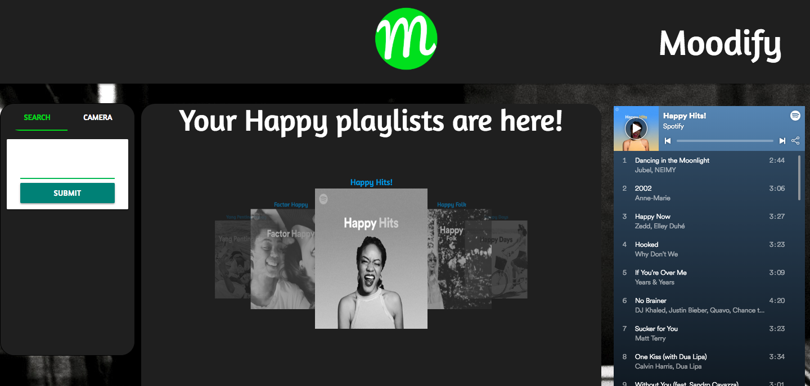

# Moodify

https://apark5040.github.io/Moodify/

## Overview
This is a front-end app that reads the mood of the user and returns playlists based of the user's mood using APIs. 





APIs used:

**Imgur - https://apidocs.imgur.com/**
Uploads the snapshot photo to imgur and then returns the imgur url. Once the process is finished, it will delete the image from Imgur.

**Kairos - https://www.kairos.com/docs/api/**
Facial recognition software which uses the snapshot image url from imgur and returns an object of different moods.

**Spotify - https://developer.spotify.com/documentation/web-api/**
After sorting the moods from Kairos, the emotion with the highest value is used to return Spotify playlists.  

The Spotify playlists shows the playlist art cover, a link to open the Spotify page or app(if on mobile), and clicking the album art will trigger the embeded player.


## Instructions

In order to use Moodify, you must create a `keys.js` file which will contain your api keys. This file must be saved inside the `assets` folder:

```
var keys = {
    spotify_id : "**INSERT SPOTIFY ID HERE**",
    spotify_secret : "**INSERT SPOTIFY SECRET KEY HERE**",
    imgur_id : "client-ID **INSERT IMGUR ID HERE**",
    kairos_id : "**INSERT KAIROS ID HERE**",
    kairos_key : "**INSERT KAIROS KEY HERE**"
}
```


 To get the API keys, you can follow the links below. You will have to first create an account before requesting the keys. The links will provide a step-by-step instructions on how to get them:

 **Spotify:** https://developer.spotify.com/documentation/general/guides/app-settings/#register-your-app


 **Kairos:**
 https://developer.kairos.com/signup


 **Imgur:**
 https://api.imgur.com/oauth2


Collabators: Andrew Park, Daniel Pruitt 


